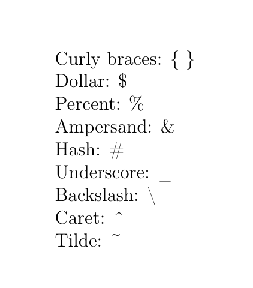

---
## Front matter
lang: ru-RU
title: "Презентация по лабораторной работе 2"
author: "Елизавета Александровна Гайдамака"

## Formatting
toc: false
slide_level: 2
# theme: metropolis
# header-includes: 
#  - \metroset{progressbar=frametitle,sectionpage=progressbar,numbering=fraction}
#  - '\makeatletter'
#  - '\beamer@ignorenonframefalse'
#  - '\makeatother'
aspectratio: 43
section-titles: true
mainfont: PT Serif
sansfont: PT Sans
monofont: PT Mono
---

# Цель работы

## Цель работы

Целью данной работы является освоение базовой структуры документа LaTeX и его компиляции в PDF.

# Задание

## Задание

- Создать и скомпилировать первый LaTeX-документ.
- Изучить преамбулу, тело документа, команды и окружения.
- Проверить работу комментариев, пробелов и специальных символов.

# Теоретическое введение

## Теоретическое введение

Документ LaTeX состоит из преамбулы и тела, а его содержимое задаётся обычным текстом и командами разметки. Исходный файл с расширением .tex компилируется в PDF с помощью LaTeX-движка, например pdflatex.

# Выполнение лабораторной работы

## Выполнение: пункт 1

1. Создать файл `first.tex`.

## Выполнение: пункт 2

2. Вставить в него простой LaTeX-документ с:
   - `\documentclass{article}`;
   - `\begin{document}`;
   - текстом;
   - `\end{document}`.

## Выполнение: пункт 3

3. Скомпилировать:

```bash
pdflatex first.tex
```

## Выполнение: пункт 4

4. Получить `first.pdf`.

## Выполнение: пункт 5

5. Открыть и проверить PDF.

## Результат: пункт 5

{width=80%}

## Выполнение: пункт 6

6. Разобраться, что такое:
   - команда LaTeX;
   - обязательные аргументы `{}`;
   - необязательные аргументы `[]`;
   - преамбула;
   - тело документа;
   - окружения `\begin{...}` / `\end{...}`.

## Выполнение: пункт 7

7. Научиться использовать комментарии `%`.

## Результат: пункт 7

{width=80%}

## Выполнение: пункт 8

8. Научиться разделять текст на абзацы.

## Результат: пункт 8

{width=80%}

## Выполнение: пункт 9

9. Проверить работу обычных и неразрывных пробелов `~`.

## Результат: пункт 9

{width=80%}

## Выполнение: пункт 10

10. Научиться запускать LaTeX из терминала:

```bash
pdflatex first
```

или

```bash
pdflatex first.tex
```

## Результат: пункт 10

{width=80%}

## Выполнение: пункт 11

11. Освоить специальные символы LaTeX: `{`, `}`, `$`, `%`, `&`, `#`, `_`, `\`, `^`, `~`.

## Результат: пункт 11

{width=80%}

# Выводы

## Выводы

Благодаря данной работе я изучила базовую структуру документа LaTeX и научилась компилировать его в PDF.
