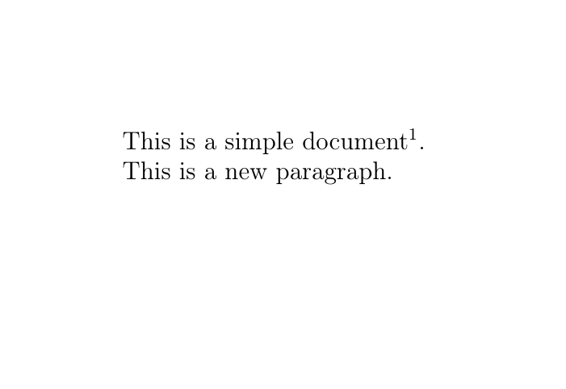
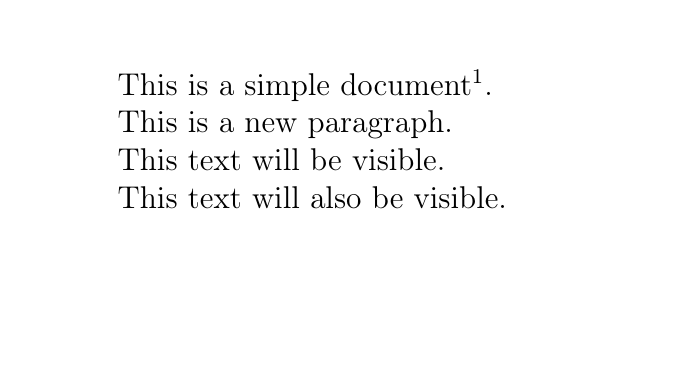
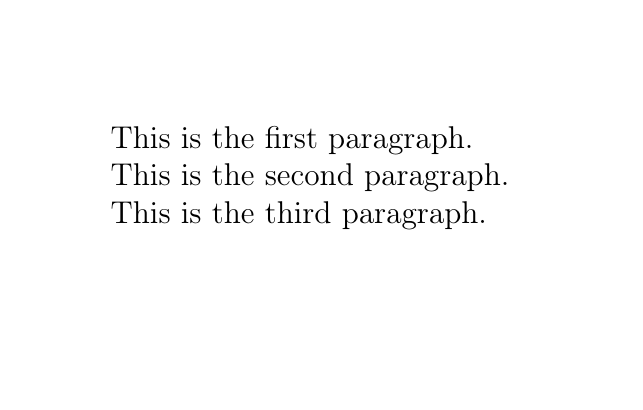
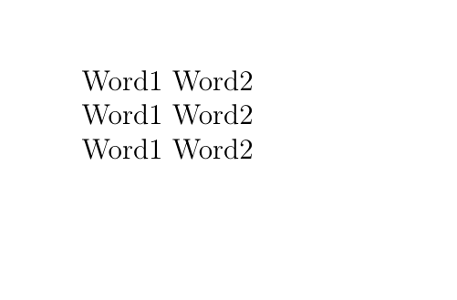
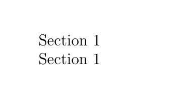
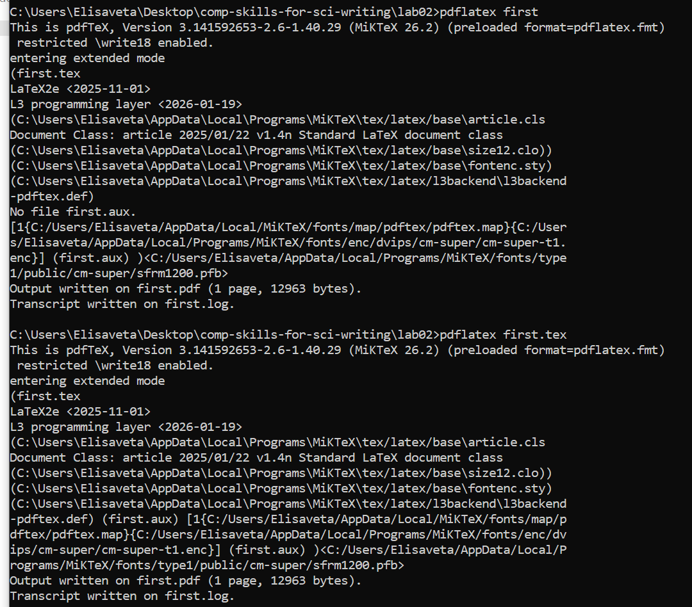

---
## Front matter
title: "Отчёт по лабораторной работе 2"
author: "Елизавета Александровна Гайдамака"

## Generic otions
lang: ru-RU
toc-title: "Содержание"

## Bibliography
bibliography: bib/cite.bib
csl: pandoc/csl/gost-r-7-0-5-2008-numeric.csl

## Pdf output format
toc: true # Table of contents
toc-depth: 2
fontsize: 12pt
linestretch: 1.5
papersize: a4
documentclass: scrreprt
## I18n polyglossia
polyglossia-lang:
  name: russian
  options:
	- spelling=modern
	- babelshorthands=true
polyglossia-otherlangs:
  name: english
## I18n babel
babel-lang: russian
babel-otherlangs: english
## Fonts
mainfont: PT Serif
romanfont: PT Serif
sansfont: PT Sans
monofont: PT Mono
mainfontoptions: Ligatures=TeX
romanfontoptions: Ligatures=TeX
sansfontoptions: Ligatures=TeX,Scale=MatchLowercase
monofontoptions: Scale=MatchLowercase,Scale=0.9
## Biblatex
biblatex: true
biblio-style: "gost-numeric"
biblatexoptions:
  - parentracker=true
  - backend=biber
  - hyperref=auto
  - language=auto
  - autolang=other*
  - citestyle=gost-numeric
## Pandoc-crossref LaTeX customization
figureTitle: "Рис."
tableTitle: "Таблица"
listingTitle: "Листинг"
lofTitle: "Список иллюстраций"
lotTitle: "Список таблиц"
lolTitle: "Листинги"
## Misc options
indent: true
header-includes:
  - \usepackage{indentfirst}
  - \usepackage{float} # keep figures where there are in the text
  - \floatplacement{figure}{H} # keep figures where there are in the text
---

# Цель работы

Целью данной работы является освоение базовой структуры документа LaTeX и его компиляции в PDF.

# Задание

- Создать и скомпилировать первый LaTeX-документ.
- Изучить преамбулу, тело документа, команды и окружения.
- Проверить работу комментариев, пробелов и специальных символов.

# Теоретическое введение

Документ LaTeX состоит из преамбулы и тела, а его содержимое задаётся обычным текстом и командами разметки. Исходный файл с расширением .tex компилируется в PDF с помощью LaTeX-движка, например pdflatex.

# Выполнение лабораторной работы

1. Создать файл `first.tex`.


2. Вставить в него простой LaTeX-документ с:
   - `\documentclass{article}`;
   - `\begin{document}`;
   - текстом;
   - `\end{document}`.



3. Скомпилировать:

```bash
pdflatex first.tex
```



4. Получить `first.pdf`.



5. Открыть и проверить PDF.



6. Разобраться, что такое:
   - команда LaTeX;
   - обязательные аргументы `{}`;
   - необязательные аргументы `[]`;
   - преамбула;
   - тело документа;
   - окружения `\begin{...}` / `\end{...}`.



7. Научиться использовать комментарии `%`.



8. Научиться разделять текст на абзацы.


9. Проверить работу обычных и неразрывных пробелов `~`.


10. Научиться запускать LaTeX из терминала:

```bash
pdflatex first
```

или

```bash
pdflatex first.tex
```


11. Освоить специальные символы LaTeX: `{`, `}`, `$`, `%`, `&`, `#`, `_`, `\`, `^`, `~`.


12. Научиться правильно выводить их в тексте.

> В главе 2 отдельного раздела `Exercises` нет.


# Выводы

Благодаря данной работе я изучила базовую структуру документа LaTeX и научилась компилировать его в PDF.
