---
## Front matter
lang: ru-RU
title: "Презентация по лабораторной работе 4"
author: "Елизавета Александровна Гайдамака"

## Formatting
toc: false
slide_level: 2
# theme: metropolis
# header-includes: 
#  - \metroset{progressbar=frametitle,sectionpage=progressbar,numbering=fraction}
#  - '\makeatletter'
#  - '\beamer@ignorenonframefalse'
#  - '\makeatother'
aspectratio: 43
section-titles: true
---

# Цель работы

## Цель работы

Целью данной работы является освоение вставки, размещения и перекрёстных ссылок на графические объекты в LaTeX.

# Задание

## Задание

- Вставить собственное изображение и изменить параметры его отображения.
- Проверить различные способы размещения плавающих объектов.
- Освоить перекрёстные ссылки с помощью label и ref.

# Теоретическое введение

## Теоретическое введение

Для включения изображений в LaTeX применяется пакет graphicx и команда includegraphics, позволяющая управлять размером и ориентацией графики. Окружение figure используется для плавающих рисунков, а команды label и ref позволяют создавать автоматические перекрёстные ссылки.

# Выполнение лабораторной работы

## Выполнение: пункт 1

1. Вставить **собственное изображение** вместо стандартной картинки из примеров.

## Результат: пункт 1

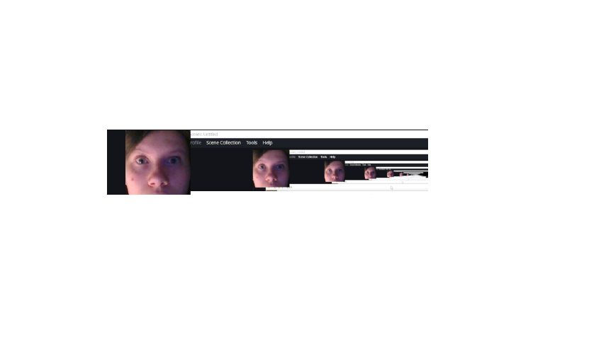{width=80%}

## Выполнение: пункт 2

2. Поэкспериментировать с параметрами `height`, `width`, `angle`, `scale`.

## Результат: пункт 2

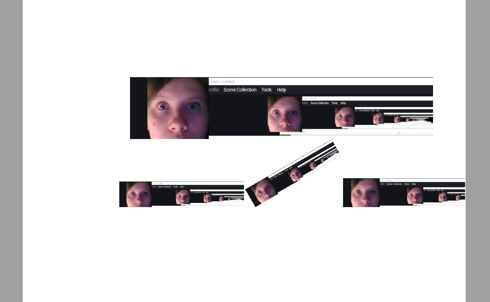{width=80%}

## Выполнение: пункт 3

3. Для одной картинки задать ширину относительно `\textwidth`.

## Результат: пункт 3

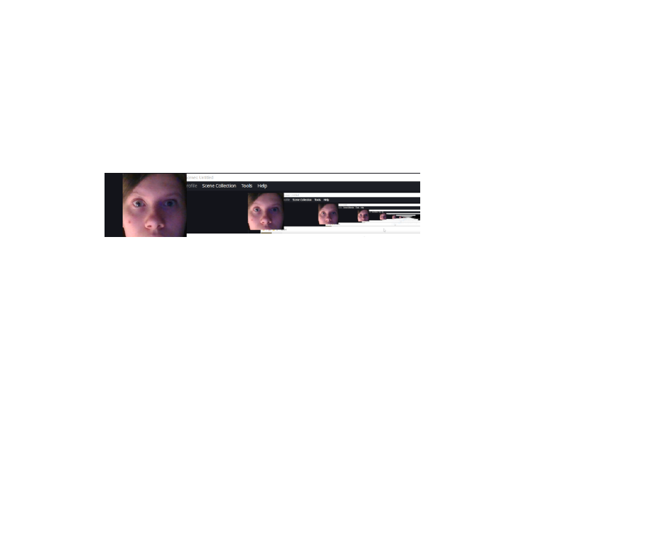{width=80%}

## Выполнение: пункт 4

4. Для другой — относительно `\linewidth`.

## Результат: пункт 4

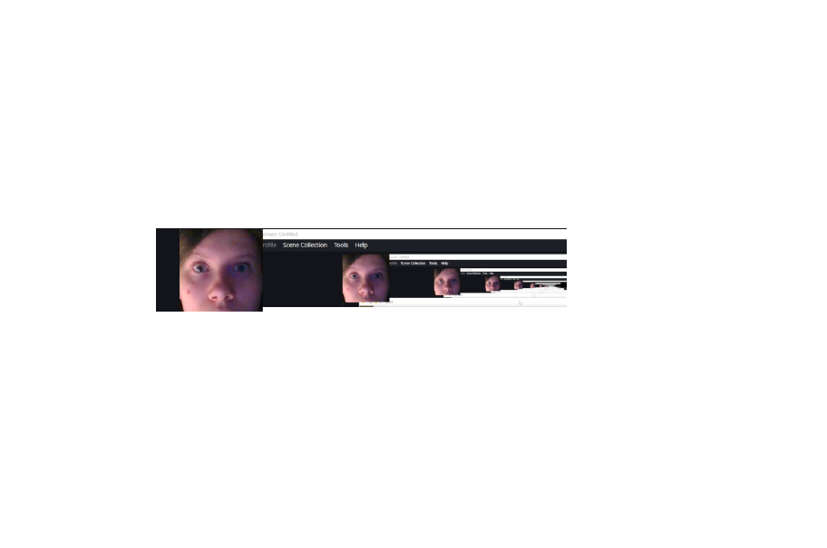{width=80%}

## Выполнение: пункт 5

5. Посмотреть разницу с `twocolumn` и без него.

## Результат: пункт 5

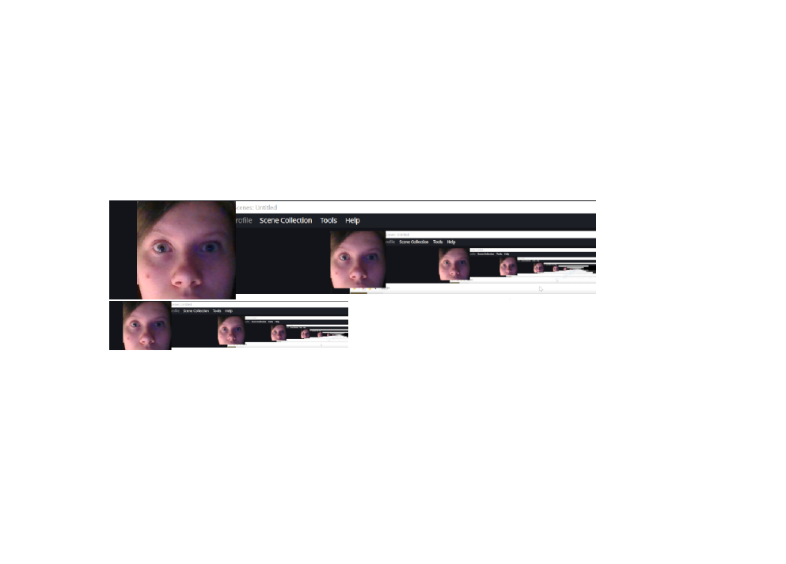{width=80%}

## Выполнение: пункт 6

6. Использовать `lipsum`, чтобы создать достаточно длинный текст.

## Результат: пункт 6

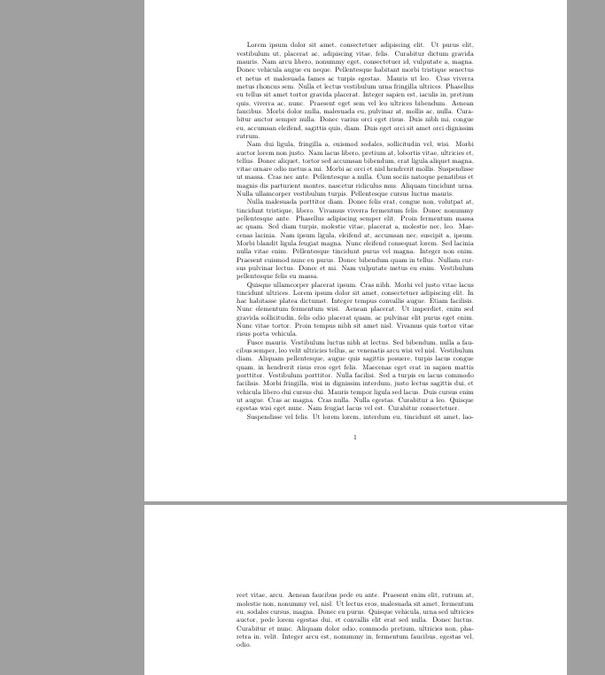{width=80%}

## Выполнение: пункт 7

7. Добавить плавающие изображения `figure`.

## Результат: пункт 7

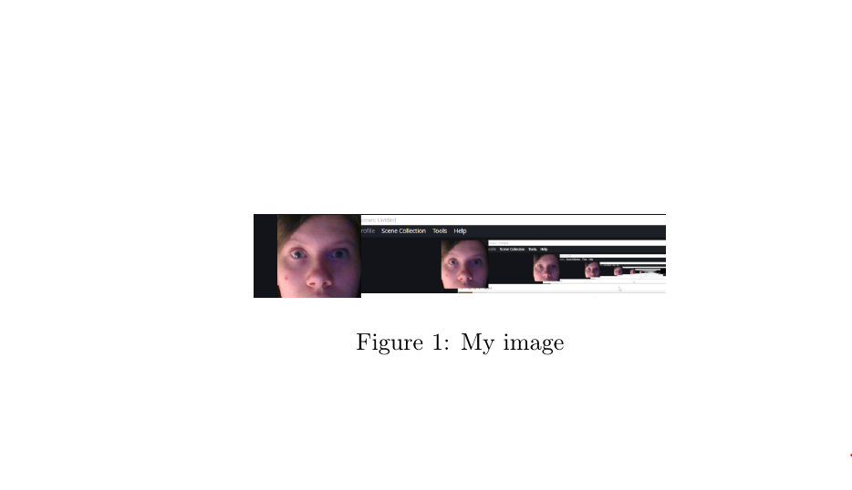{width=80%}

## Выполнение: пункт 8

8. Проверить разные спецификаторы размещения: `h`, `t`, `b`, `p`.

## Результат: пункт 8

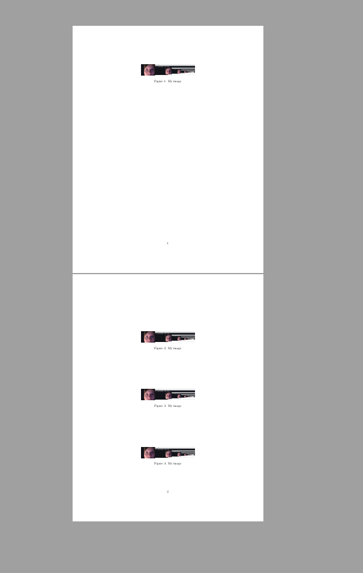{width=80%}

## Выполнение: пункт 9

9. Посмотреть, как они взаимодействуют.

## Результат: пункт 9

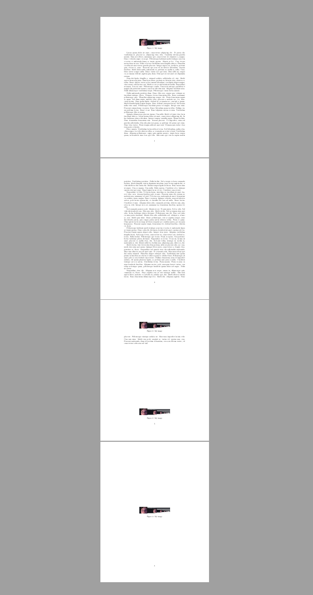{width=80%}

## Выполнение: пункт 10

10. Добавить новые нумерованные элементы: `section`, `subsection`, нумерованные списки.

## Результат: пункт 10

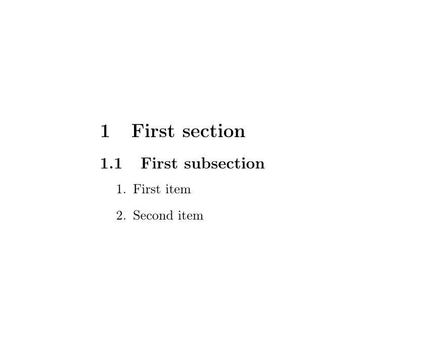{width=80%}

## Выполнение: пункт 11

11. Проверить, сколько запусков LaTeX требуется, чтобы корректно заработали `\label` и `\ref`.

## Результат: пункт 11

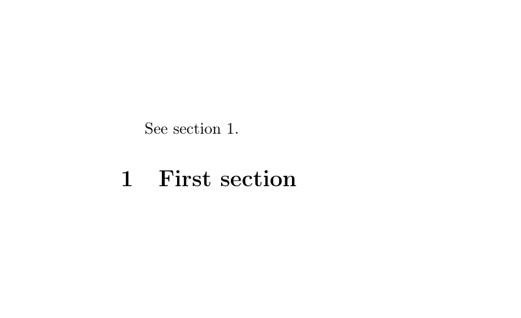{width=80%}

## Выполнение: пункт 12

12. Добавить float-объекты.

## Результат: пункт 12

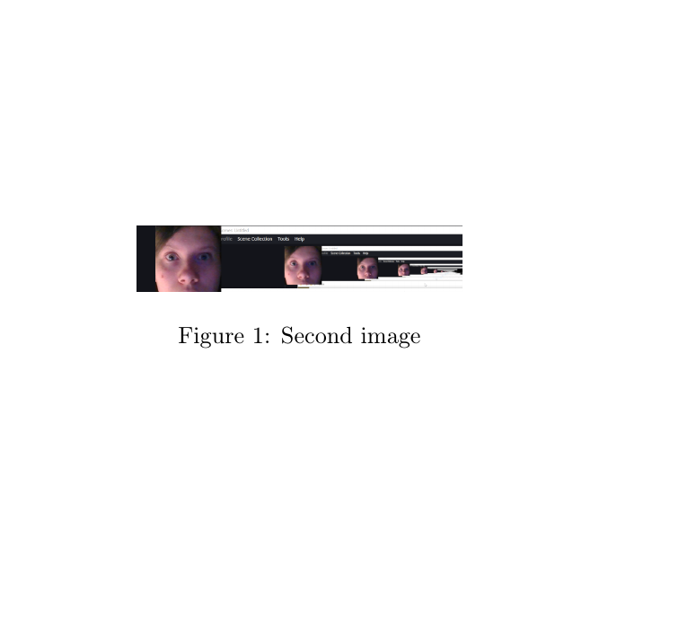{width=80%}

## Выполнение: пункт 13

13. Поставить `\label` **перед** `\caption` и посмотреть результат.

## Результат: пункт 13

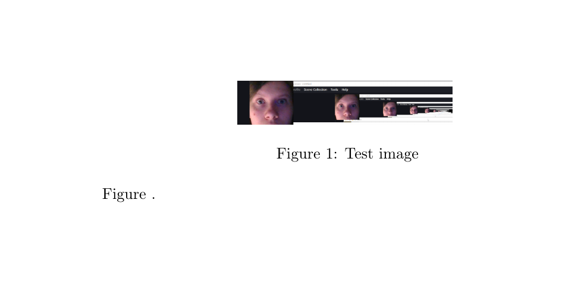{width=80%}

## Выполнение: пункт 14

14. Затем поставить его правильно — после/внутри `\caption`.

## Результат: пункт 14

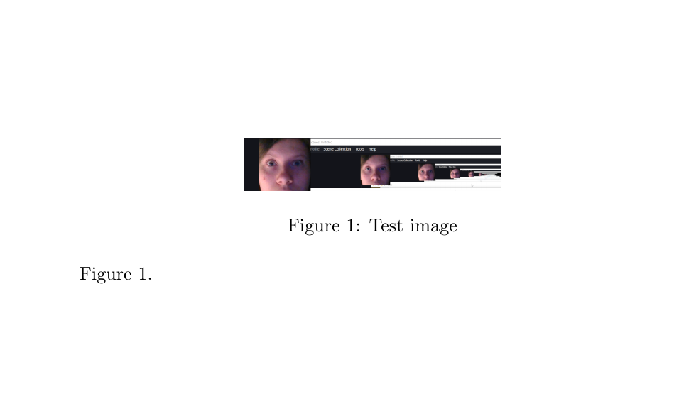{width=80%}

## Выполнение: пункт 15

15. У уравнения поставить `\label` после `\end{equation}`.

## Результат: пункт 15

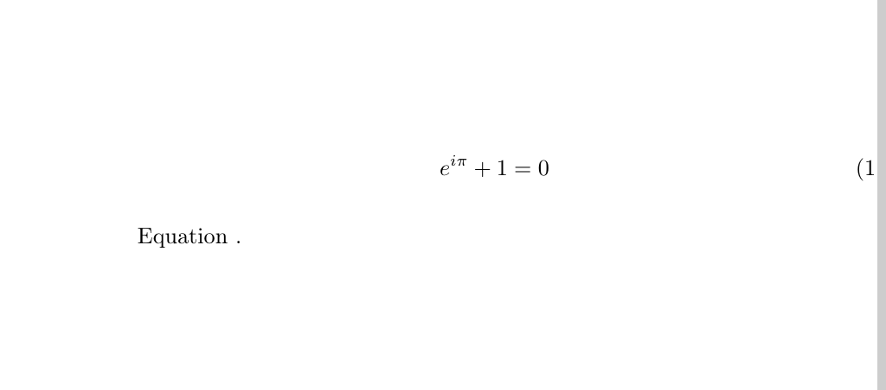{width=80%}

## Выполнение: пункт 16

16. Посмотреть, что произойдёт.

## Результат: пункт 16

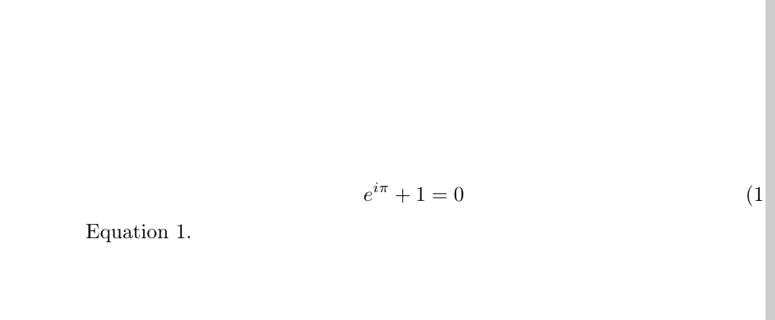{width=80%}

# Выводы

## Выводы

Благодаря данной работе я научилась вставлять и размещать графические объекты в LaTeX, а также создавать перекрёстные ссылки на них.
