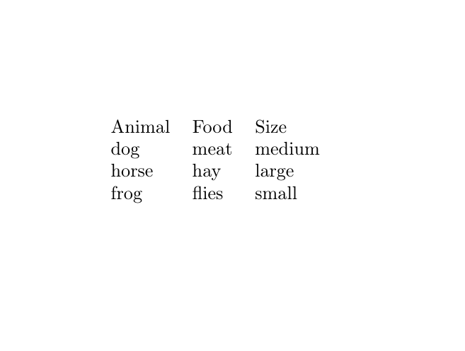
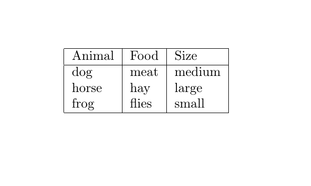
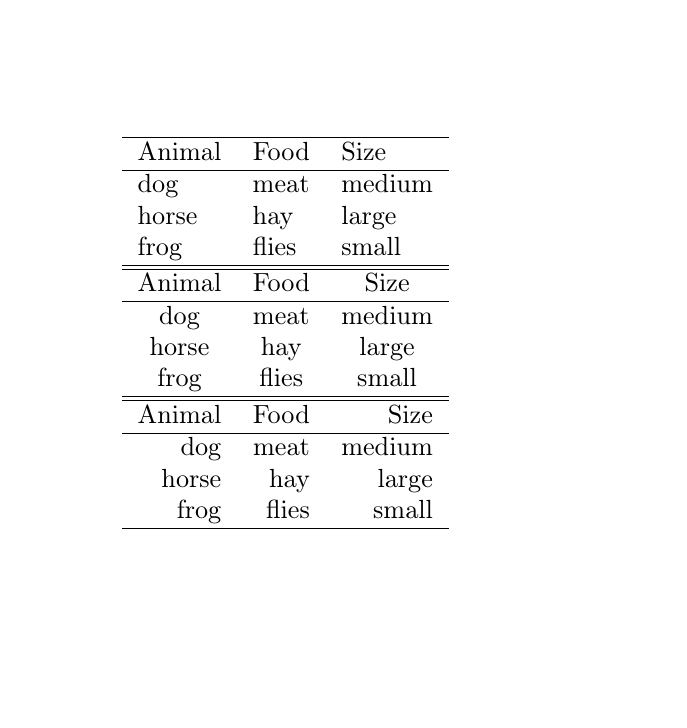
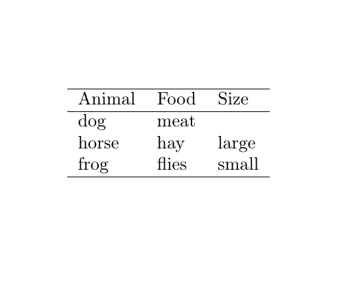
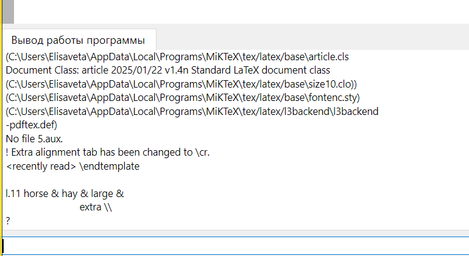
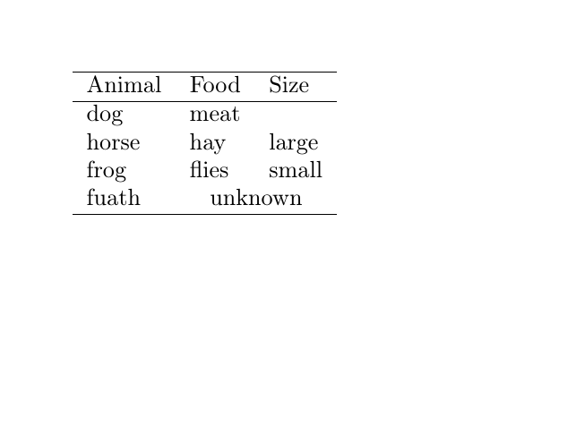
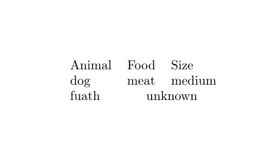

---
## Front matter
lang: ru-RU
title: "Презентация по лабораторной работе 5"
author: "Елизавета Александровна Гайдамака"

## Formatting
toc: false
slide_level: 2
# theme: metropolis
# header-includes: 
#  - \metroset{progressbar=frametitle,sectionpage=progressbar,numbering=fraction}
#  - '\makeatletter'
#  - '\beamer@ignorenonframefalse'
#  - '\makeatother'
aspectratio: 43
section-titles: true
---

# Цель работы

## Цель работы

Целью данной работы является освоение создания и форматирования таблиц средствами LaTeX.

# Задание

## Задание

- Создать простую таблицу и проверить выравнивание столбцов.
- Исследовать поведение строк с неверным количеством элементов.
- Освоить объединение столбцов с помощью multicolumn.

# Теоретическое введение

## Теоретическое введение

Таблицы в LaTeX создаются с помощью окружения tabular, где для каждого столбца задаётся тип выравнивания. Ячейки разделяются символом &, строки завершаются двойным обратным слешем, а команда multicolumn позволяет объединять несколько столбцов.

# Выполнение лабораторной работы

## Выполнение: пункт 1

1. Взять простую таблицу из примера книги.

## Результат: пункт 1

{width=80%}

## Выполнение: пункт 2

2. Начать экспериментировать с её оформлением.

## Результат: пункт 2

{width=80%}

## Выполнение: пункт 3

3. Попробовать разные типы выравнивания столбцов: `l`, `c`, `r`.

## Результат: пункт 3

{width=80%}

## Выполнение: пункт 4

4. Сделать строку, в которой **слишком мало элементов**, и посмотреть результат.

## Результат: пункт 4

{width=80%}

## Выполнение: пункт 5

5. Сделать строку, в которой **слишком много элементов**, и посмотреть результат.

## Результат: пункт 5

{width=80%}

## Выполнение: пункт 6

6. Использовать `\multicolumn`.

## Результат: пункт 6

{width=80%}

## Выполнение: пункт 7

7. Объединить несколько столбцов.

## Результат: пункт 7

{width=80%}

# Выводы

## Выводы

Благодаря данной работе я научилась создавать и форматировать таблицы средствами LaTeX.
