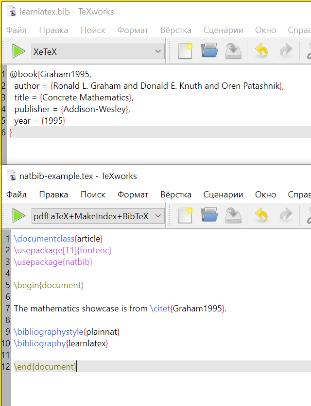
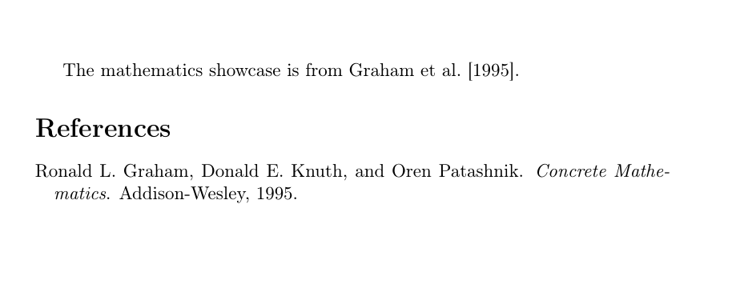
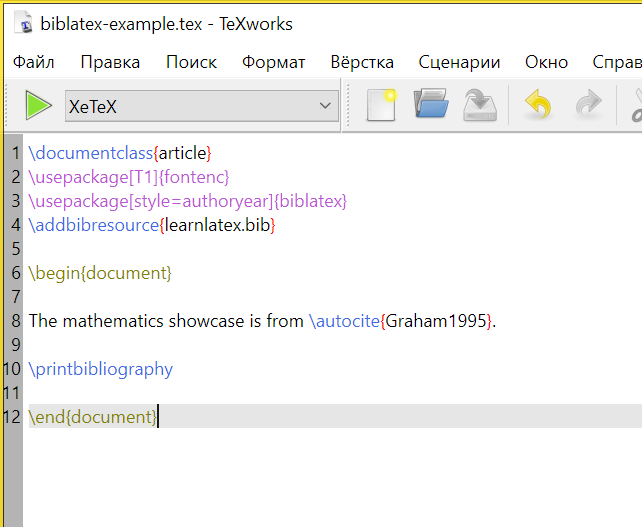
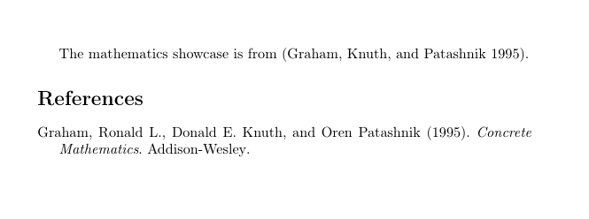
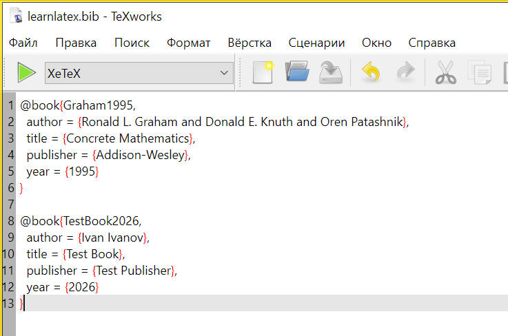
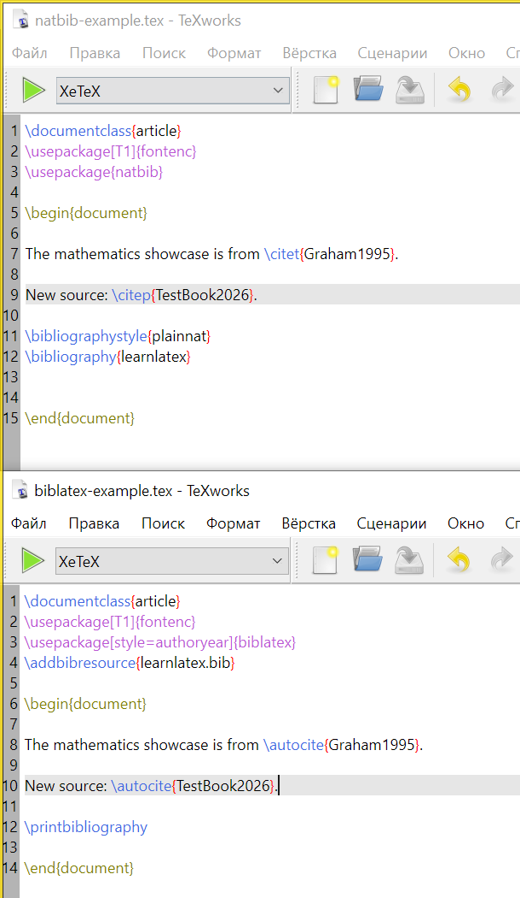
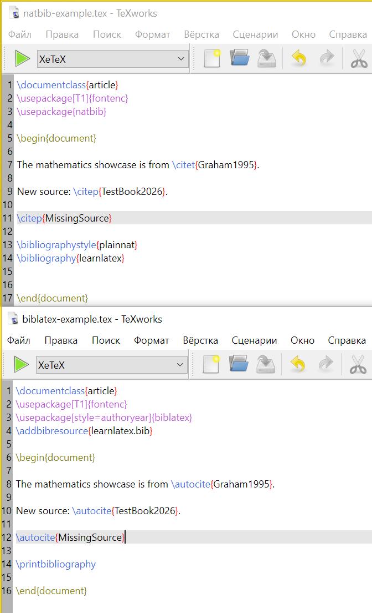
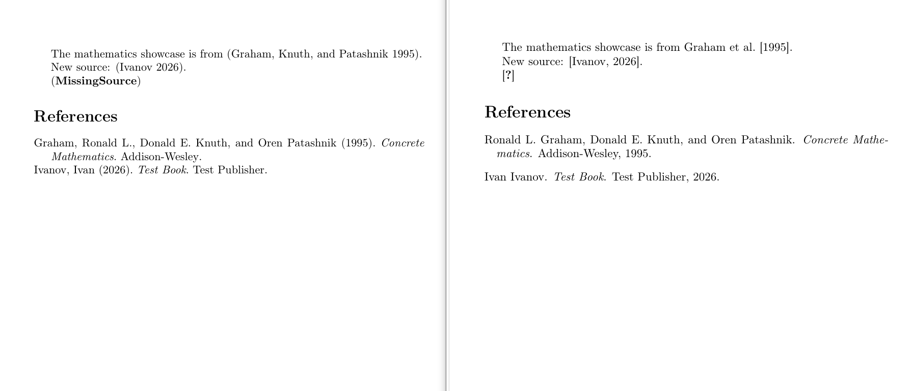
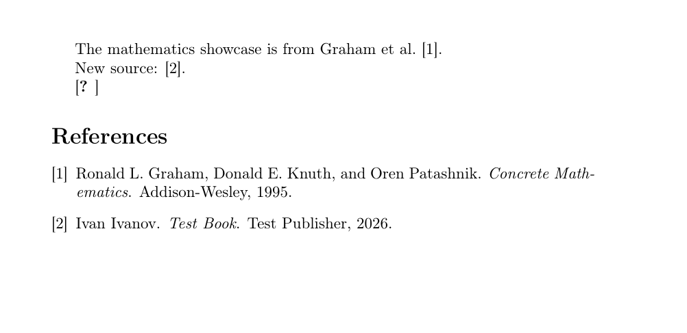
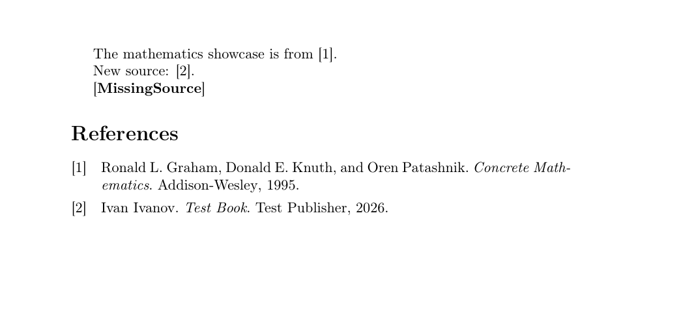

---
## Front matter
lang: ru-RU
title: "Презентация по лабораторной работе 6"
author: "Елизавета Александровна Гайдамака"

## Formatting
toc: false
slide_level: 2
# theme: metropolis
# header-includes: 
#  - \metroset{progressbar=frametitle,sectionpage=progressbar,numbering=fraction}
#  - '\makeatletter'
#  - '\beamer@ignorenonframefalse'
#  - '\makeatother'
aspectratio: 43
section-titles: true
---

# Цель работы

## Цель работы

Целью данной работы является освоение создания библиографической базы и оформления цитирований средствами BibTeX и biblatex.

# Задание

## Задание

- Проверить работу библиографии с natbib/BibTeX и biblatex/Biber.
- Добавить новые библиографические записи и цитирования.
- Сравнить обычный и числовой стили цитирования.

# Теоретическое введение

## Теоретическое введение

Библиографические данные обычно хранятся отдельно от основного документа в файлах .bib и подключаются по ключам цитирования. Для обработки библиографии могут применяться связки natbib с BibTeX или biblatex с Biber.

# Выполнение лабораторной работы

## Выполнение: пункт 1

1. Попробовать пример с `natbib` и BibTeX.

## Результат: пункт 1

{width=80%}

## Выполнение: пункт 2

2. Для него выполнить последовательность:

```text
LaTeX
BibTeX
LaTeX
LaTeX
```

## Результат: пункт 2

{width=80%}

## Выполнение: пункт 3

3. Попробовать пример с `biblatex` и Biber.

## Результат: пункт 3

{width=80%}

## Выполнение: пункт 4

4. Для него выполнить:

```text
LaTeX
Biber
LaTeX
```

## Результат: пункт 4

{width=80%}

## Выполнение: пункт 5

5. Создать новые записи в `.bib`-базе.

## Результат: пункт 5

{width=80%}

## Выполнение: пункт 6

6. Добавить новые цитирования этих записей.

## Результат: пункт 6

{width=80%}

## Выполнение: пункт 7

7. Добавить цитирование источника, которого **нет в базе**.

## Результат: пункт 7

{width=80%}

## Выполнение: пункт 8

8. Посмотреть, как оно отобразится.

## Результат: пункт 8

{width=80%}

## Выполнение: пункт 9

9. Попробовать числовой стиль для `natbib`.

## Результат: пункт 9

{width=80%}

## Выполнение: пункт 10

10. Попробовать `style=numeric` для `biblatex`.

## Результат: пункт 10

{width=80%}

# Выводы

## Выводы

Благодаря данной работе я научилась создавать библиографическую базу и оформлять цитирования средствами BibTeX и biblatex.
